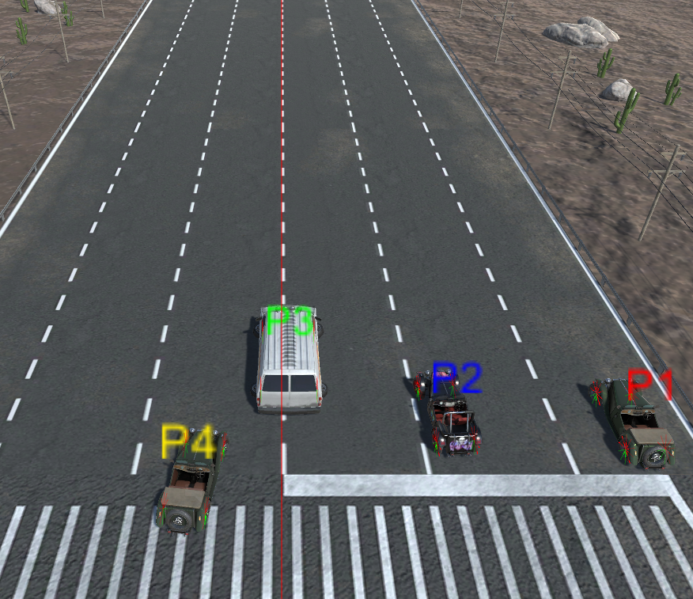
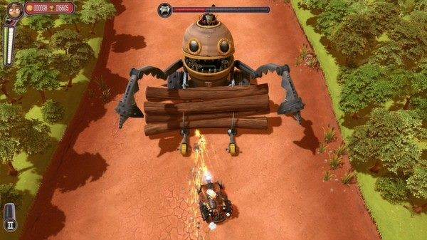
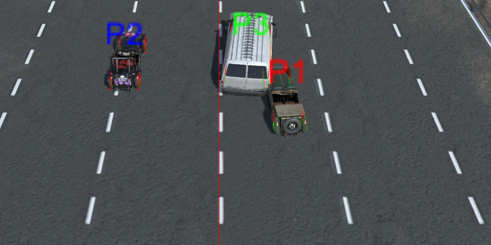
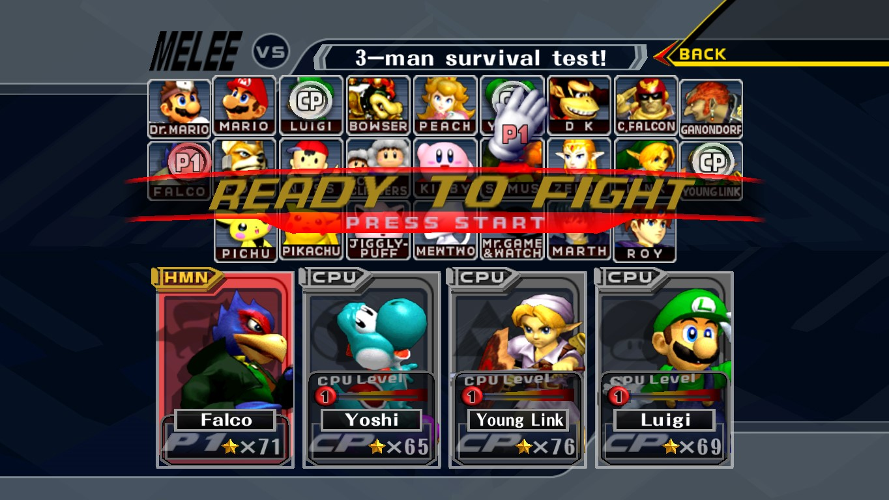

#Dodge This Racing Post Mortem

##Introduction
In this Post Mortem, I will focus mainly on evaluating the challenges involved in leading the programming team. This is because while I did quite a bit of the programming for this project, and I learned a lot of new technical skills, I believe that the leadership and organizational challenges were the most profitable for me. Indeed, I had not before been put in a situation where I had to lead a team and was a bit afraid at the start. Nevertheless, being the most experience programmer in team, it was logical for me to lead the rest of the programmers in this project. While there were some moments were I felt my lack of experience, it was overall a very enriching experience for me that might actually push me to seek leadership position in team projects.

##Project Overview

This is a Unity project for the Physics in Video Games course in which we were separated in groups and had to work on creating a Destruction Derby based video game over the course of several months. My team contained 6 programmers: Me, Javier Osa Escalada, Baggio Pereira, Stefanos Katsaros, Federico Soncini, and Elio de Berardinis. In addition, we had two artists: Martin Skarregaard and Kun An Li. 

After doing some research on the existing local multiplayer driving games, we decided that we wanted to follow the example of the game Pressure. We were particularly interested in the point of view of the camera, which would allow us to display all 4 players on the same screen thus avoiding the need to render the scene 4 times in local multiplayer. In addition this point of view was advantageous compared to a top down view because we were afraid that a game where the camera is not behind the player might not feel right for the player.

Figure 1 - A screenshot of Pressure, one of the inspirations for our game.

As far as the gameplay goes, we wanted to use a life based system to choose the winner. We decided that in addition to dying due to collisions with other objects, we wanted to allow players to kill each other by simply outrunning them. In our game, the camera will always follow the player which is in leading position. Whenever a player goes out of the field of view of the camera, this player dies and respawns next to the leading contestant. Once a player runs out of lives, he will no longer respawn and when a single player remains, he is declared the winner. This means that there are several ways to win the race depending on the situation. Focusing on going as fast as possible might allow you to kill all your competitors, however if they do well they will be able to keep up with you. Being more aggressive will allow you to make sure that a specific player loses a life, but it also exposes you to other player that might be trying to outrun you.

Figure 2 - Some cars fighting each other

Another interesting element of the game is that we wanted to randomize the creation of the track. While the competitors are racing, the game will chose random track pieces and add them to the existing track while removing the track pieces that have already been used. This allows us to both have an interesting, always random track, but also have a potentially infinite track which means that the race can keep going until only one player remains.
In order to add some variety, we have added some presets of obstacles. When a track piece is spawned, a random preset is chosen randomly. Depending on the present a number of obstacles will be spawned at predetermined locations. 
The character selection screen was mostly inspired from the Super Smash Bros. Melee game. On it, players are able to select their cars and their controls schemes. They are also able to set up the computer controlled players if they want to have some. The cars are controlled by choosing one of 4 control schemes: WASD, Arrow Keys, Controller1 and Controller2. 

Figure 3 - The SSBM character selection screen which inspired ours

##Team’s communication

One of the biggest issues we faced in the team communication was to be able to work with everyone’s schedule. In our team, we had multiple people that were part time first year, someone that was part time second year, and only very few people that were full time. This meant that have everyone present in meetings was not possible. We did still try to meet quite frequently (every Monday & Friday) with the people that were available. After those meetings, I would generally try to write up a summary of the meeting & the state of the project for anyone that wasn’t able to attend.

Something else that would did to help keep everyone up to date is to create a Facebook group for the project, which was used to inform everybody of the latest news and set up meetings and assignments. In addition, I would often meet after classes with someone from the team who wasn’t able to attend meeting to work on issues and agree on assignments.
The Holidays did have an impact, as people were less available to meet and work on assignments, but that was expected so we had made sure to make enough progress beforehand to make sure not to be caught. Overall we still ended up doing more progress than I expected during the Holidays which was a very nice surprise.

The Search for a Star round 2 competition was also a bit of an issue because it happened right at the start of the assignment. I knew that I wanted to focus on the SFAS competition because it was an important opportunity for me so I warned my teammates that I would not be able to devote as much time as I wanted to this project during the first two weeks. This meant that the first two weeks of the project did not see much progress. It was especially problematic because we had to build a basis before we could really split the assignment in different tasks. Ultimately however, we got a lot of work done after those two weeks and managed to catch up on our late start.

I had some concerns regarding the communication at the start of the project, however I think it turned out quite well in the end. We knew from the start that everybody wouldn’t be able to attend the meetings, but the Facebook group was very important in keeping everyone on the same page, and in giving everyone something to work on.

Because I was the most experienced developer of the team, I found myself to be in a position where I had to handle assignments and keeping everyone working in the same direction. It was a challenge, and not something I had a lot of experience in, however I think everyone in the team really tried to pull their own weight and contribute to the project, which made my work much easier. While being in a position of leadership was a bit daunting at the start, it ended up being a very interesting experience that I look forward to repeating.

##Team’s use of technology

Everybody in the team had previously used Unity for other projects, which means that everybody was able to contribute to the project from the start. Some people were not very familiar with GitHub however, but after some explanations they were able to pick it up quickly.

Our two artists were using two different modeling software, which caused some consistency issues with the structure of the models, however once they learned the differences between their software, the structure of the gameobjects became consistent.
Despite having used Unity before, this project was the opportunity to learn a lot about some features of Unity we had not used before. As an example, daunting we implemented the AI on a different thread to improve performance. It would run in the background and update the car’s instructions regularly. We learned that with Unity, you are not able to access any object of the scene from a different thread, which meant that we had to store all the data we needed on the main thread and then access that object to handle the calculations of the AI.

##Lessons learned
 
* The first two weeks when I was unavailable because of the Search for a Star competition were not very productive. I believe that in a project like that it would be useful to get in touch with everyone in order to have a schedule of everyone’s availability and to work on assignments and deadlines around that.

* We should have established a structure for the vehicles from the start and always made sur that each new vehicle followed that structure. Changes in the structure of a gameobject were an issue because it sometimes affected the scripts that were attached to those gameobjects and thus should be avoided as much as possible.

* I should have pushed everyone more to keep pulling the latest data from master when they start working on the project. We’ve lost a lot of time in solving conflicts and issues that were caused by merging very out of date branches.

* The facebook group (or equivalent) was extremely helpful and I would definitely reuse it in a new project.

* At the start of the project, we wanted to split the part one assignment in several parts. After finding a website that explained in details how to implement a physics-based car model, I decided to split the different sections of this explanation into tasks that I distributed to the different team members. In insight – that might not have been a wise choice. The sections had parts reliant on one another and did not split up well. Overall we probably would have had less trouble had I given someone or a few people the task to implement the car using this system and assign other tasks to the rest of the team (such as the detachable parts or the track generation).

